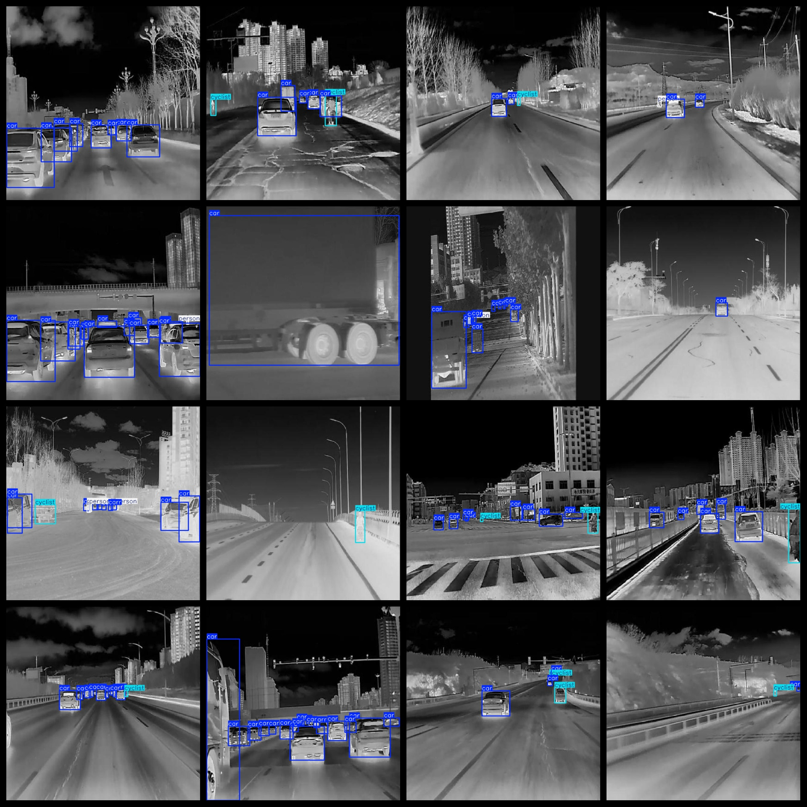

# In-Vehicle Viewpoint IR Road Target Detection Dataset: 7544 Images in VOC+YOLO Format

The dataset consists of 7544 images, organized in VOC format and supplemented with YOLO format. It is packaged in three folders: JPEGImages, Annotations, and labels, each containing specific types of files.

In the JPEGImages folder, there are a total of 7544 JPEG images.

The Annotations folder contains 7544 XML files, which provide detailed information about each image's content.

Lastly, the labels folder contains 7544 txt files, detailing the labels for each image based on the categories provided.

There are a total of three label categories: car, cyclist, and person. The number of bounding boxes (boxes) for each category can be found as follows:

- Car: 51878 boxes
- Cyclist: 3147 boxes
- Person: 5635 boxes

Total box count across all categories: 60660 boxes.

The images in this dataset are of high resolution clarity, ensuring accurate detection results. Additionally, the images were not enhanced to maintain the integrity of the data.

The repository for this dataset can be found at `datasets_sl`.

The labeled shapes used for target detection are rectangular boxes, designed to facilitate accurate identification of objects within the images.

It is important to note that no guarantees are made regarding the accuracy or precision of any trained models or weight files using this dataset. The focus is solely on providing a reliable and accurate dataset for research and development purposes.

## Images

---

Here is a pay link on Stripe (https://buy.stripe.com/3cs8yP7sY87d0vu9AB). Please contact me lonlonago@foxmail.com after funding $89, and I will send you a complete data files, thank you!

